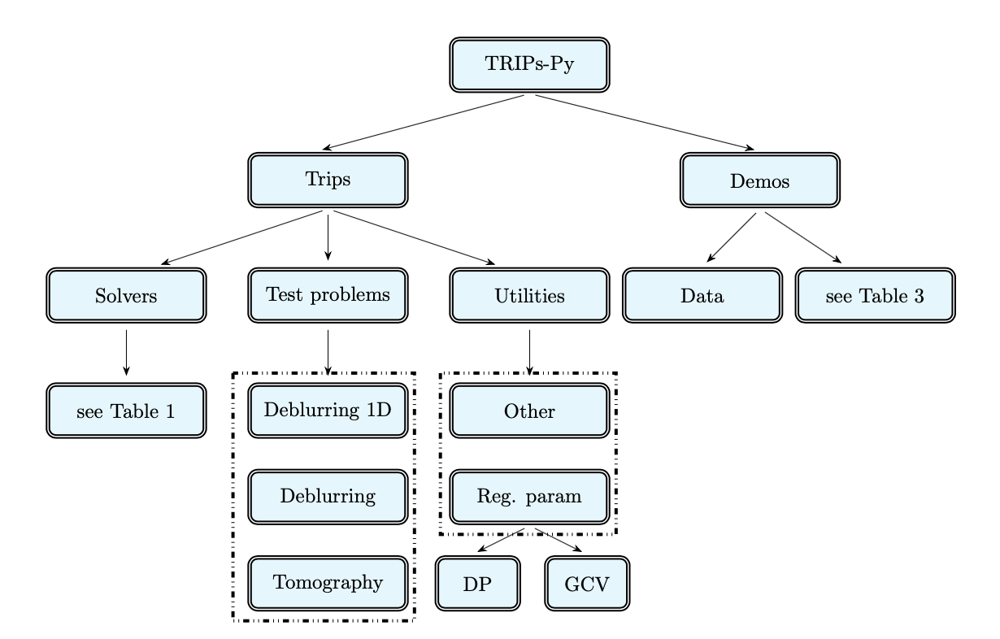

# TRIPs - Py


TRIPS-py is a python package that is dedicated to serve research and didactical purposes.  The package aims
1) to provide tools for solving small and large scale inverse problems, and
2) to introduce test problems arising from a wide range of applications such as deblurring, X-ray computerized tomography, and dynamic X-ray computerized tomography.

TRIPs-Py includes a wide range of regularization methods for solving linear discrete inverse problems. Each method incorporates options to determine the regularization parameter automatically through the discrepancy principle (if the noise level is known) or through generalized cross validation. A regularization parameter can be inputed from the user too.

### Building TRIPs-Py from source code 

##### Clone the repository

```ruby
git clone https://github.com/trips-py/trips-py
```

##### Install the package and the dependencies
```ruby
pip install .
```

##### In Windows (if issues arise please change the following code in the setup.py file)

```ruby
with open('README.md', 'r', encoding="utf-8") as fh:
    LONG_DESCRIPTION = fh.read()
    setuptools.setup(...)
```

### Data for test problems
For a smooth usage of the package, we recommend the users to first download the data needed for test problems from the google drive and place the folder data inside the folder demos.
https://drive.google.com/drive/folders/1VB8LaFewgwNKXq7QSVns4D6Rod8W8Pa1?usp=sharing

### Overview of the TRIPs-Py's structure and contents


Most of the files available in the `Utilities' directory are auxiliary functions that can be used by the TRIPs-Py solvers, such as functions to set the regularization operators, or to display data and reconstructions.

### Reference
Mirjeta Pasha, Silvia Gazzola, Connor Sanderford, Ugochukwu O. Ugwu
TRIPs-Py: Techniques for Regularization of Inverse Problems in Python
 
#### Arxiv link 
https://doi.org/10.48550/arXiv.2402.17603

### Requirements
Packages required that are installed automatically with TRIPs-Py are
'numpy', 'scipy', 'pylops', 'requests', 'h5py', 'tqdm', 'python-resize-image', 'astra-toolbox'.

### Disclaimer
TRIPs-Py package is made available and contributed to under the Apache-2.0 license. The project is offered “as-is” without warranty, and disclaiming liability for damages resulting from using the software. 
This is a first version of TRIPs-Py and it is by no means perfect. We welcome comments and suggestions from the users to improve the software. Interested users are welcome to contribute to the package.
For assistance or questions regarding the package, please send an email to contact.tripspy@gmail.com.

### Contact
email: contact.tripspy@gmail.com
website: https://sites.google.com/view/mirjeta-pasha/home?authuser=1

### Acknowledgments
The work of Mirjeta Pasha is fully supported by the NSF award DMS 2202846. Mirjeta Pasha and Silvia Gazzola acknowledge the Isaac Newton Institute for Mathematical Sciences, Cambridge, for the support and hospitality during the programme Rich and Nonlinear Tomography - a multidisciplinary approach" (supported by EPSRC grant no EP/R014604/) where partial work on this package was undertaken. SG would like to thank Ludovico Carozza for his advice on many Python functionalities. We would like to thank Tatiana Bubba for discussions about avoiding inverse crimes in `inverse problems'.


