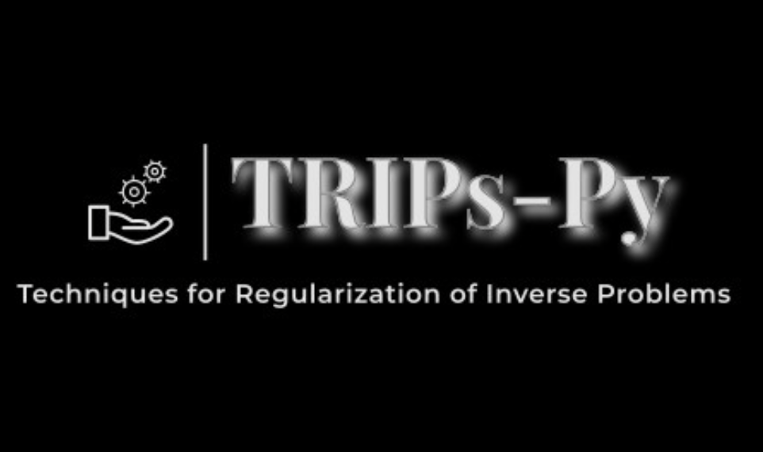

# TRIPS - Py


TRIPS-py is a python package that is dedicated to serve research and didactical purposes.  The package aims
1) to provide tools for solving small and large scale inverse problems, and
2) to introduce test problems arising from a wide range of applications such as deblurring, X-ray computerized tomography, and dynamic X-ray computerized tomography.

TRIPS-py includes both direct and iterative methods for solving discrete inverse problems as well as a wide range of regularization techniques. 
Each method incorporates options to determine the regularization parameter automatically through discrepancy principle (if the noise level is known) or through generalized cross validation. A regularization parameter can be inputed from the user too.


### Building TRIPs-Py from source code 

##### Clone the repository

```ruby
git clone https://github.com/trips-py/trips-py
```

##### Install the package and the dependencies
```ruby
pip install .
```

### Reference
Mirjeta Pasha, Silvia Gazzola, Connor Sanderford, Ugochukwu O. Ugwu
TRIPs-Py: Techniques for Regularization of Inverse Problems in Python


